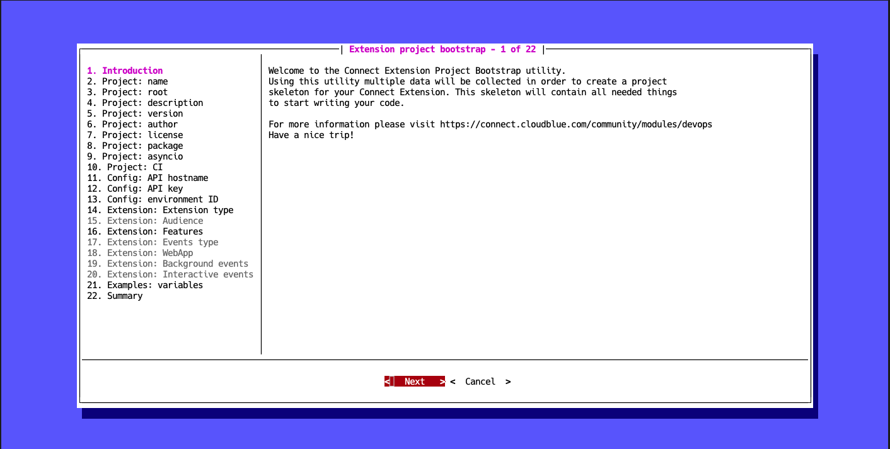

The quickest way to build an extension project is by using the [CloudBlue Connect CLI](https://github.com/cloudblue/connect-cli).

Open your terminal and use the following command to bootstrap a new extension project:

```
$ ccli project extension bootstrap
```

This command will launch a wizard that will help configure your extension:




Once this wizard finalizes the bootstrap operation, a directory with the following structure will be created:

```
.
└── <project_root>
    ├── <package_name>
    │   ├── __init__.py
    │   ├── extension.json
    │   └── ...
    ├── tests
    │   ├── __init__.py
    │   ├── conftest.py
    │   └── ...
    ├── .git
    ├── .gitignore
    ├── LICENSE
    ├── README.md
    ├── CHANGELOG.md
    ├── HOWTO.md
    ├── docker-compose.yml
    ├── Dockerfile
    ├── poetry.toml
    ├── pyproject.toml
    └── ...
```

## Project root content

The following describes the content of your generated project root folder:

* **README.md**: This file is intended to provide a description of your extension project. It is
    used by the `pyproject.toml` file to add a description to your python package and will also be renderered on
    the main page of your git repository in various git hosting services.
* **CHANGELOG.md**: This file is used to track changes between versions of your extension.
    In case your `Multi Account Installation` extension is published in the Connect Showroom Catalog, your changelog will also be rendered in the Catalog.
* **HOWTO.md**: Provides useful information about basic tasks related to the development of your extension.
* **LICENSE**: This file represents your specified agreement of the open-source licence for releasing your extension.
* **poetry.toml**: This file is used to disable the creation of a Python virtual environment when using Poetry. The creation of a
    virtual environment is disabled since extensions are developed inside a docker container by default.
* **.gitignore**: A default file that helps avoid commiting unsupported files within the git repository, such as `pyc` files, 
    `coverage.xml` and so on.

The `Connect CLI` can also be used to deploy your extension project. Note that your extension can be deployed in the *Cloud* mode and hosted on a git server accesible through the internet, hence the presence of a `.git` directory.


### pyproject.toml

The root folder of your extension project should include a `pyproject.toml` file. This will be used by 
[Poetry](https://python-poetry.org/) to build a package of your extension.


It is required to use this file to specify both runtime and development dependencies for your extension. Such specifications should also include an entrypoint for each type of your implemented applications.

The bootstrap wizard provides the runtime dependencies to this file. Specifically, `connect-eaas-core` and other suggested development dependencies for testing and linting your code. Moreover, the wizard also adds all required entrypoints for your selected applications during the bootstrap operation.

!!! info
    Entrypoints must be declared in the ```[tool.poetry.plugins."connect.eaas.ext"]``` section with the following structure:
    
        "application_type" = "path.to.package:ApplicationClass"

    <u>One application type can only have **one** entrypoint class</u>.
    
    Available application types are **eventsapp**, **webapp** and **anvilapp**.


### docker-compose.yml

Developing and deploying your extension by using [Docker](https://docker.com) is not mandatory, **but it is strongly recommended**.

The bootstrap wizard generates a default **docker-compose.yml** and **Dockerfile** for your extension.

The **docker-compose.yml** defines three services named after your extension plus the following suffixes:

* **_dev:** This service is used to run your extension locally.
* **_bash:** Allows accessing your extension container in bash for development and testing purposes.
* **_test:** Runs the linter and the unit tests suite.

### Dockerfile

The **Dockerfile** allows building an image with provided `python` (and optionally `node.js`) dependencies.
It works with the `Connect Extension Runner` image that is based on the [python 3.10 slim](https://hub.docker.com/_/python)
image. It also includes node.js runtime version `16.*`.


## Python package

The python package contains the **extension.json** descriptor file and your application entrypoints:

* **anvil.py:** This file and its corresponding `anvil application entrypoint` class are present in case the `Anvil Application` option is selected during the bootstrap operation.
* **events.py:** In case the `Events Applciation` option is selected, the CLI tool generates the `events.py` file and adds the `events application entrypoint` class with an event handler for each event you selected while working with the bootstrap wizard. It also adds an example handler for working with schedules.
* **webapp.py:** This file and the `web application entrypoint` class are present if the `Web Application` option is selected during the bootstrap operation.

!!! info
    Specifying entrypoint names is not mandatory. However make sure that your required entrypoints are added within the same directory that contains the **extension.json** file.


## Tests package

The `Connect CLI` allows streamlining your test operations by using [pytest](https://docs.pytest.org/en/7.2.x/).
Consequently, you can find a **tests** package and default [**conftest.py**](https://docs.pytest.org/en/6.2.x/fixture.html)
with pytest fixures that enable to test your extension code.

Depending on your selected application types, the following files will be present:

* **test_anvil.py:** Contains examples on how to test your `Anvil Application`.
* **test_events.py:** Examples on how to test your `Events Application`.
* **test_webapp.py:** Examples on how to test your `Web Application`.


## Web Application with UI

In case of creating a `Web Application` that is embedded in the Connect UI, the following additional files and directories will be
created:

```
.
└── ${project_slug}
    ├── ui
    │   ├── pages
    │   │   ├── index.html
    │   │   └── settings.html
    │   ├── src
    │   │   ├── components.js
    │   │   ├── pages
    │   │   │   ├── index.js
    │   │   │   └── settings.js
    │   │   ├── pages.js
    │   │   └── utils.js
    │   ├── styles
    │   │   └── index.css
    │   └── tests
    │       ├── components.spec.js
    │       ├── pages.spec.js
    │       └── utils.spec.js
    ├── __mocks__
    │   ├── fileMock.js
    │   └── styleMock.js
    ├── babel.config.json
    ├── jest.config.js
    ├── webpack.config.js
    └── package.json
```

!!! info
    UI artifacts will be generated within the `static` folder of your extension python package.


!!! note
    The `Connect CLI` will generate an example UI written with vanilla JavaScript.
    You can use Vue.js, Angular, React or any other Web framework. The `Connect UI Toolkit` is a
    framework agnostic library, and thus it can be used with any framework of your choice.


!!! warning
    UI generated artifacts must be places in a folder called `static` and this folder must be placed
    in the same folder where your `Web Application` entrypoint module is located.
    For cloud execution of your extension, the content of the `static` folder must be commited
    within the git repository since in the cloud mode your UI artifacts are copied to a blob storage and
    served from there.

### package.json

This file contains the configuration that are necessary to handle your UI development by using node/npm.
It declares both runtime and development dependencies as long as the following scripts (that can be called using `npm run <script_name>`) are present:

* **build:** runs **webpack** to produce UI artifacts.
* **watch:** watches for changes to your UI source files and rebuilds them if these files are changed.
* **lint:** launches the linter to analyze your code.
* **test:** runs your tests suite by using **jest**.

The `Connect CLI` will also add the [Connect UI Toolkit](https://github.com/cloudblue/connect-ui-toolkit) library and
the `roboto` fonts as runtime dependencies.

### webpack.config.js

This file contains default [webpack](https://webpack.js.org/) configuration to build your UI artifacts. By default, `css` and `js` files are minifed. It also injects corresponding scripts and css dependencies into your html files.

### babel.config.json

This file contains default configuration for [babel](https://babeljs.io/) that allows using `ECMAScript 6` modules.

### jest.config.js

This file contains default configuration for [Jest](https://jestjs.io/) testing framework.

### ui folder

The ui folder will contain your UI source files as long as your tests specs.


!!! info
    * Applications are stateless
    * UI is served by a blob storage for the cloud mode
