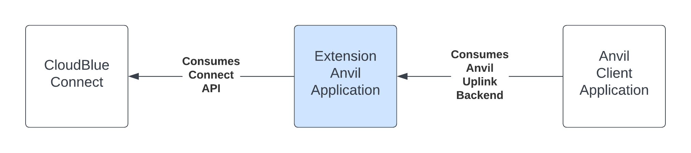
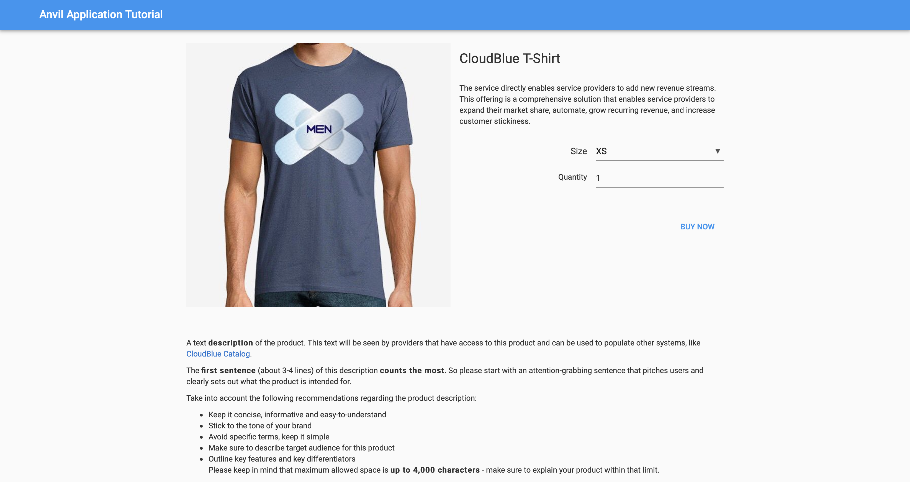

This tutorial provides step-by-step guidelines for creating a `Hub Integration` extension that implements an anvil application. Provided concepts from this tutorial are also applicable to the `Fulfillment Automation` and `Multi Account Installation` extensions configuration.

Anvil applications allow integrating the CloudBlue Connect platform with your created Anvil client app as schematically illustrated in the following diagram:

!!! note
    In case more information about Anvil and Anvil Server Uplink is required, refer to the [Anvil Website](https://anvil.works) and [Anvil Uplink documentation](https://anvil.works/docs/uplink).

This tutorial demonstrates how to create an Anvil client application that is used to purchase a t-shirt item and automatically create a fulfillment request on the Connect platform. 

!!! warning
    This tutorial assumes that you are using a *nix operating system. In case of using Windows, it is required to convert all provided commands to Windows Shell commands.
