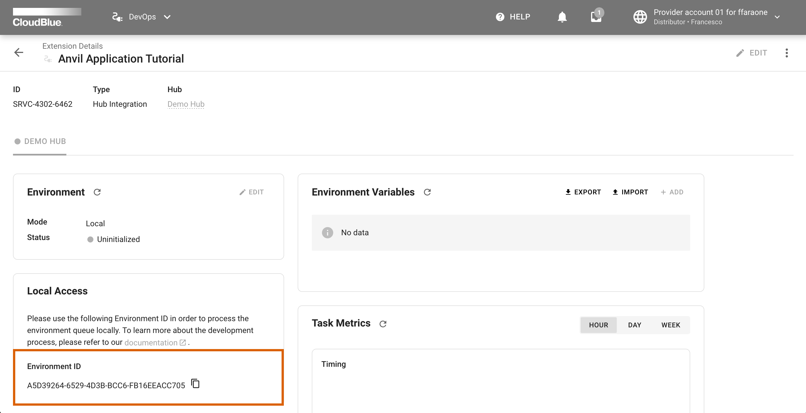

Once your `Anvil Application` is configured, use the guidelines below to test it.

Make sure that the following prerequisites are met before inititing your test operations:

* You have a **vendor** account on the CloudBlue Connect platform
* Your Connect **distributor** account includes a configured **marketplace** 
* Your ``Anvil trial account`` is registered


## Create a t-shirt product

Sign into your `vendor` account and create a product that will be used for the following tests.

!!! info
    In case you are not familiar with the `Products` module on Connect, use the documentation that is provided on the Connect
    [Community Portal](https://connect.cloudblue.com/community/modules/products/).

1. Sign into your `vendor` account and create a t-shirt product via the Connect UI.
2. Go to the **Product Parameters** tab and remove the default parameters.
3. Add a new `choice` product parameter, assign the `ordering` phase and select the `subscription` scope.
4. Add the following choices to your list:
    *   label `XS` value `xs`
    *   label `S` value `s`
    *   label `M` value `m`
    *   label `L` value `l`
    *   label `XL` value `xl`
5. Set the parameter ID to `size`.
6. Switch to the `Versions` tab and create a public version of your t-shirt product.

!!! tip
    Make sure to copy your **product ID** since it is required for the following operations.

## Create a listing request

Use your `vendor` account and the **Listing** module to list your created product to your marketplace:

!!! info
    If you are not familiar with the `Listings` module on Connect, refer to the corresponding documentation on
    [Community Portal](https://connect.cloudblue.com/community/modules/listings/).

1. Proceed to the `Listings` module and click the `Manage Listing` button.
2. Follow the `Manage Listing` wizard and select your configured marketplace.

!!! tip
    Copy your **marketplace ID** since it is required for the following operations.


## Accept your request

Sign into your `distributor` account and use the `Listing` module to start processing your listing request:

1. Navigate to the `Requests` tab of the Listings module
2. Access your created listing request with your t-shirt product.
3. Click on the `Mark as deploying` button at the top-right corner of the interface.
4. Finalize your product listing operations by using the `Mark as completed` button

## Create a hub connection

Use your `distributor` account and the **Products** module to create a new connection with your hub:

!!! info
    In case more detailed instructions on how to create a hub connection are required, refer to 
    [this article](https://connect.cloudblue.com/community/modules/marketplaces/connections/).

* Access your t-shirt product via the `Products` module on Connect.
* Switch to the `Connections` tab and click the `Create Connection` button.

!!! tip
    Copy your **connection ID** since it is necessary for the following procedures.


## Create Anvil Client Application

Once your [Anvil trail account](https://anvil.works) is registered, you can create a new Anvil Client Application.
Use the following link to quickly setup your application: [Download a pre-defined Anvil Application](../../assets/anvil_application_tutorial.yml).

Go to your Anvil account and select `My Apps` via the header bar in the main menu.  
From the `My Apps` page, click on the **`Import from file`** link:


Upload your Anvil Client Application and you will be redirected to the Anvil editor. Open the settings menu on the left side bar (i.e. click on the :material-cog: icon) and choose the **`Uplink...`** option:


Click the `Enable the Anvil Server Uplink for this app` button in the `Anvil Uplink` dialog:


Subsequently, the system will provide your `Uplink key`.

!!! tip
    Make sure to copy your uplink key since it is required for the following operations.


Once your uplink key is copied and saved, close the `Anvil Uplink` dialog

Next, proceed `Main Form` editor and click on the `Code` button.

Locate the `PRODUCT_ID` constant and provide your t-shirt product ID value to this constant.


## Create a `hub integration` extension

Use the Connect UI to create a new `Hub Integration` extension and copy its environment identifier.

Sign into your `distributor` account and navigate to the `DevOps` module. Start creating a new extension by clicking the **Add Extension** button.  
Select the `Hub Integration` type and specify your hub that is associated with your configured marketplace and your configured t-shirt product:


Once your extension object is created, access the extension details screen by clicking on its name:


Switch to the `DEV` environment tab that will be used for the following tests:



Locate the `Local Access` widget and click on the :material-content-copy: button to copy your **environment ID**.


## Update your environment file 

Edit your `.tshirt_dev.env` file and provide the `ENVIRONMENT_ID` variable with your copied value.
Furthermore, make sure that your `API_KEY` is assigned to your created API token.


!!! note
    Note that your created API key should also include all required module permissions.
    For more information on how to create an API Key, refer to the
    [Community Portal](https://connect.cloudblue.com/community/modules/extensions/api-tokens/).


## Build a Docker Image

Use the following bash command to build a docker image for your extension:


``` bash
$ docker compose build
```

## Run your extension

Once your docker image is composed, execute the following command to run your container:

``` bash
$ docker compose up tshirt_dev
```
Next, go to the Connect UI and check whether your extension is connected to the `DEV` environment by
using the :material-refresh: button located in the `Environment` widget.

Note that the provided `Environment Variables` widget should have assigned values for each of the configured variables demonstrated in this tutorial. Confirm your assigned variables by clicking the **Apply Changes** button.

## Create an order from your Anvil Client Application

Go to the Anvil application editor and click the `Run` button via in the header bar.

Once your application is loaded, choose a size for a t-shirt by using the `size` dropdown menu.
Provide an integer value for `quantity` and then press the `Buy Now` button.

As a result, a new purchase request should be generated on the CloudBlue Connect platform.

!!! success "Congratulations"
    :partying_face: Your configured `Anvil Application` works like a charm :beers:
