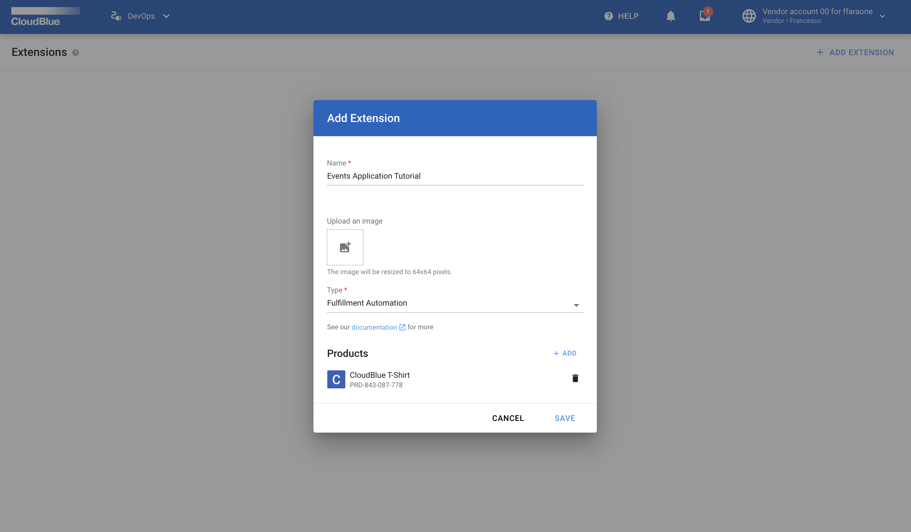
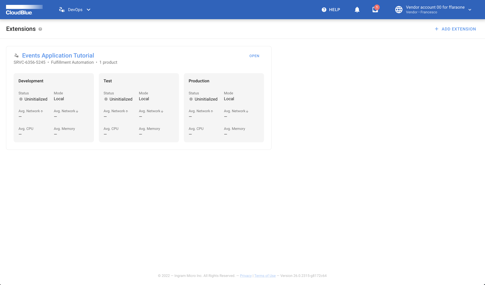
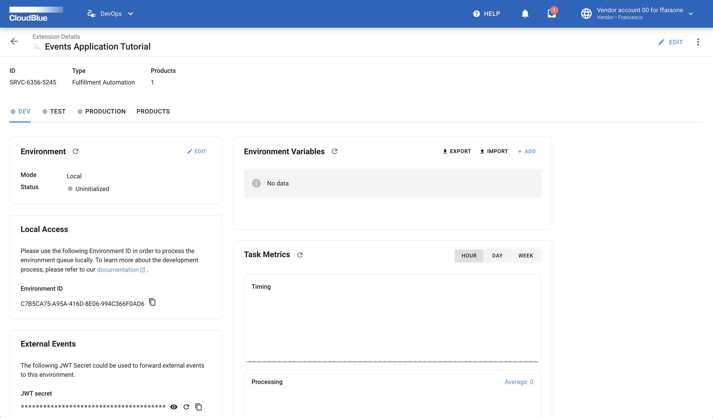

Now that your `Events Application` is ready it's time to test it.

## Create a t-shirt product

!!! note
    If you are not familiar with the `Products` module of Connect you can read the documentation in the Connect
    [community portal](https://connect.cloudblue.com/community/modules/products/).

* As a `vendor` go to the Connect User Interface and create a t-shirt product.
* Go to the `Product Parameters` view and remove the parameters that have been created by default.
* Add a product `ordering` parameter with a `subscription` scope of type `choice`.
* Add the following choices:
    *   label `XS` value `xs`
    *   label `S` value `s`
    *   label `M` value `m`
    *   label `L` value `l`
    *   label `XL` value `xl`
* Set the parameter ID to `size`.
* Go to the product settings and enable the subscription purchase request `draft validation` capability.


## Create a `Fulfillment Automation` extension

To do that you first need to go to the Connect UI to create an extension of type `Fulfillment Automation`.
From the main menu, navigate to the `DevOps` module and click the `Add extension` button
Fill the Add extension form like in the following picture choosing the product you created in the previous step:



Once created, open the details view of your brand new extension:



And select the `DEV` environment tab:



Go to the `Local Access` widget and click on the :material-content-copy: button to copy your environment ID.


## Update your `.tshirt_dev.env` environment file 

Edit your `.tshirt_dev.env` file and fill the `ENVIRONMENT_ID` variable with the copied value.


!!! warning
    This tutorial assume that you know how to create a Connect API key and that the
    `API_KEY` variable of the `.tshirt_dev.env` file is set with a valid value.
    For more information about how to create an API Key visit the
    [Connect Community Portal](https://connect.cloudblue.com/community/modules/extensions/api-tokens/).


## Build a Docker image for your extension

To build the Docker image for your extension run:


``` bash
$ docker compose build
```

## Run your extension

Once the image is build, to run your container execute:

``` bash
$ docker compose up tshirt_dev
```

Now go to the Connect UI and check that your extension is connected to the `DEV` environment
using the :material-refresh: button located in the `Environment` widget.

## Create a `preview` fulfillment request

Now go back to your t-shirt product and select the `preview` view

Follow the wizard to create a preview purchase request.

You will see that when you select the size for your t-shirt it will be validated by your extension.
If the size you choose is out of stock you will receive an error during the validation.

If the size you choose is available you will se how the new purchase request will be auto-approved
by your extension.


!!! success "Congratulations"
    :partying_face: your first `Events Application` works like a charm :beers: