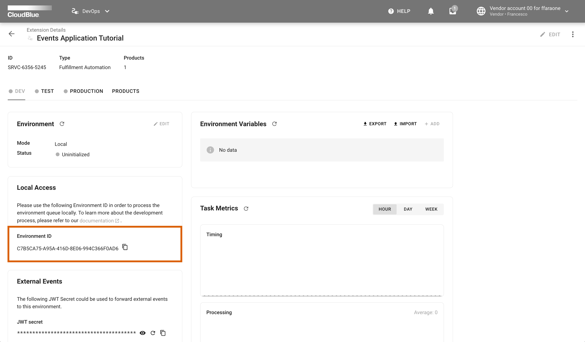

Once your `Events Application` is created, it is required to configure a product, define your extension on Connect, and prepare a docker image for the following tests.

## Configure your product

Create a product on the Connect platform that will be used for the following tests.

!!! note
    In case you are not familiar with the `Products` module on Connect, use the documentation that is provided on the Connect
    [Community Portal](https://connect.cloudblue.com/community/modules/products/).

1. Sign into your `vendor` account and create a t-shirt product via the Connect UI.
2. Go to the **Product Parameters** tab and remove the default parameters.
3. Add a new `choice` product parameter, assign the `ordering` phase and select the `subscription` scope.
4. Add the following choices to your list:
    *   label `XS` value `xs`
    *   label `S` value `s`
    *   label `M` value `m`
    *   label `L` value `l`
    *   label `XL` value `xl`
5. Set the parameter ID to `size`.
6. Go to the **product settings** and enable the `draft validation` capability for your subscription purchase requests.


## Create a `fulfillment automation` extension

Use the Connect UI to create a new `Fulfillment Automation` extension and copy its environment identifier:

Navigate to the `DevOps` module and click the **Add Extension** button.  
Select the `Fulfillment Automation` type and specify your configured product:


Once your extension object is created, access the extension details screen by clicking on its name:


Switch to the `DEV` environment tab that will be used for the following tests:



Locate the `Local Access` widget and click on the :material-content-copy: button to copy your **environment ID**.


## Update your environment file 

Edit your `.tshirt_dev.env` file and provide the `ENVIRONMENT_ID` variable with your copied value.
Make sure that your `API_KEY` is assigned to your created API token on the Vendor account that includes your configured product.


!!! note
    Note that your created API key should also include all required module permissions.
    For more information on how to create an API Key, refer to the
    [Community Portal](https://connect.cloudblue.com/community/modules/extensions/api-tokens/).


## Build a Docker Image

Use the following bash command to build a docker image for your extension:


``` bash
$ docker compose build
```

## Run your extension

Once your docker image is composed, execute the following command to run your container:

``` bash
$ docker compose up tshiert_dev
```

Next, go to the Connect UI and check whether your extension is connected to the `DEV` environment by
using the :material-refresh: button located in the `Environment` widget.

## Create a `preview` subscription

When your extension is deployed, create a new `preview subscription` by using the *Subscriptions* module or via 
the *Preview* tab within your product profile page.

Consequently, your selected t-shirt size should be validatied by your deployed extension. In case your selected size is out of stock, you should receive an error during the request validation. If your selected size is available, your new purchase request should be auto-approved by your extension.


!!! success "Congratulations"
    :partying_face: Your configured `Events Application` works like a charm :beers:
