In this tutorial we will create a `Fulfillment Automation` extension project using
the CloudBlue [Connect CLI](https://github.com/cloudblue/connect-cli).


## Requirements

To complete this tutorial you need:

* Python 3.8, 3.9 or 3.10
* [Docker](https://www.docker.com/)
* Latest release of [Poetry](https://python-poetry.org/)
* Latest release of [Connect CLI](https://github.com/cloudblue/connect-cli)
* A CloudBlue Connect **vendor** account


## Add the vendor account to the Connect CLI configuration

To configure the CLI to use your vendor account you need an API Token.

To create the token open the Connect UI portal and:

* navigate to to `Integrations` -> `Tokens`
* click on the `+ Create Token` button
* set a `name`, a `description` and an optional `external id` for the token and click `Next`
* choose `Custom Integration` from the list of extension then click `Next`
* in the list of permissions select at least `DevOps` then click `Create`
* on the summary screen click `Go To Details`
* on the token detail view click the :material-content-copy: button to copy your token.

Then open your terminal and run:

```
$ ccli account add "<your copied token>"
```

where `<your copied token>` must be replaced with the token you generated in the previous step.


## Create an extension in the DevOps module

To create the `Fullfilment Automation` extension open the Connect UI portal and navigate to the `DevOps` module:

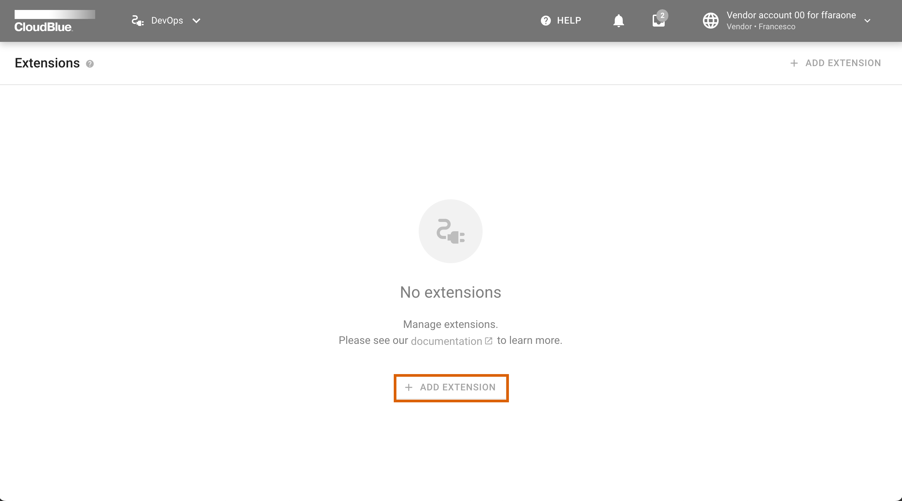

Click on the `+ Add Extension` button, the add extension dialog will be shown:

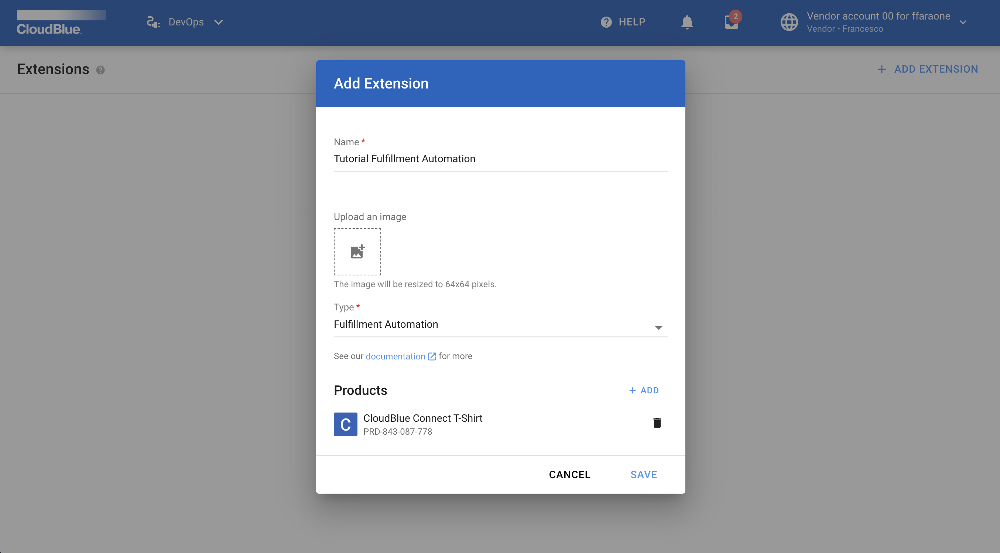

Fill the name, optionally the icon, choose at least one product and then click `Create`. The list of your extension will be shown:

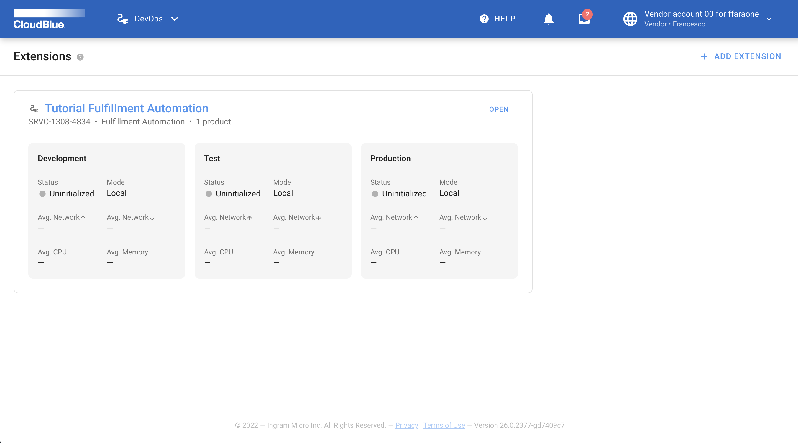

Click on the `Open` button of your newly created extension, the detail page will be shown:

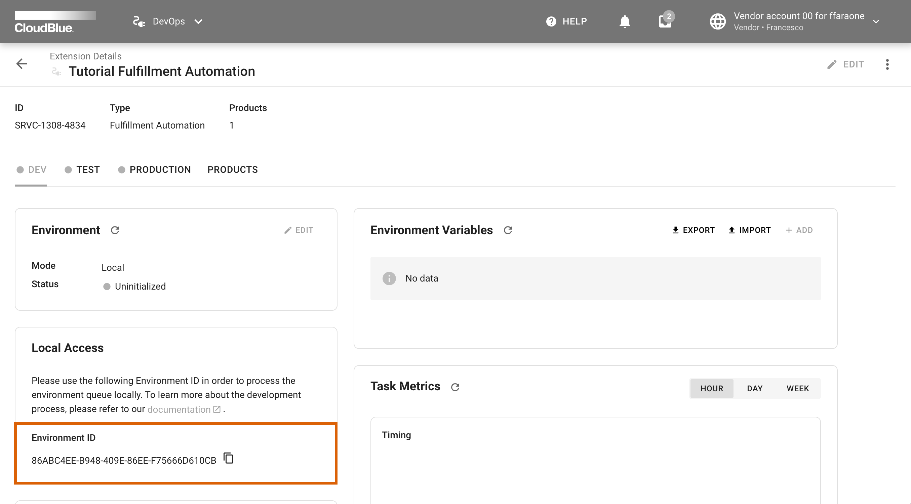

In the `Local Access` widget click on the :material-content-copy: button to copy the Environment ID.


## Run the `Extension Project Bootstrap` wizard

To run the wizard run in your terminal:

```
$ ccli project extension bootstrap
```

The welcome screen will be shown:


## Choose a name for your extension


This name will be used for packaging metadata.


## Choose the name of the project root folder


This folder will be created at the end of the wizard and will contain
all the needed file.


## Briefly describe your extension


This description is used to generate a readme file and for packaging metadata.


## Set an initial version number for your extension


This version is used for packaging metadata.


## Set the author name of your extension


The author will be used for packaging metadata and to add a copyright header in each generated file.


## Choose a name for your extension's python package

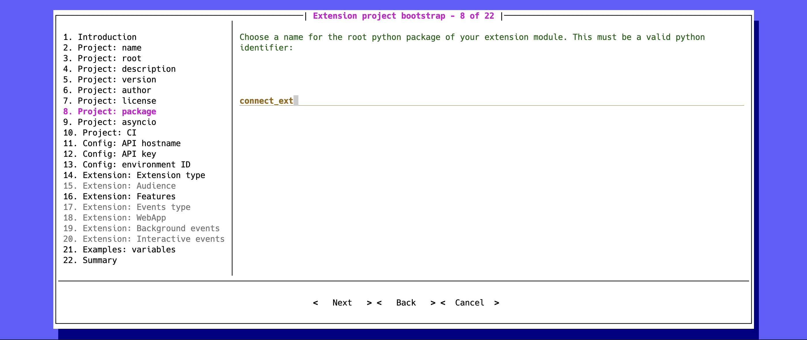


## Choose between synchronous and asynchronous programming

If you are familiar with python asyncio programming select `yes` in the following step:


## Github actions

If you plan to host your git repository on github.com and you want to automate the
continuous integration of your project select `yes` in the following step and an actions workflow file
will be created for you:

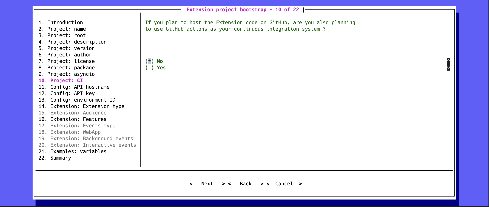


## Api Hostname

The wizard will propose by default the hostname of the Connect production environment:


## Api Key

The wizard will propose to use the same Api Key you used to configure your vendor account in the CLI:


## Environment ID

Fill the environment ID with the value you copied from the `Local Access` widget of your extension:


## Extension type

Select `Fulfillment Automation`:

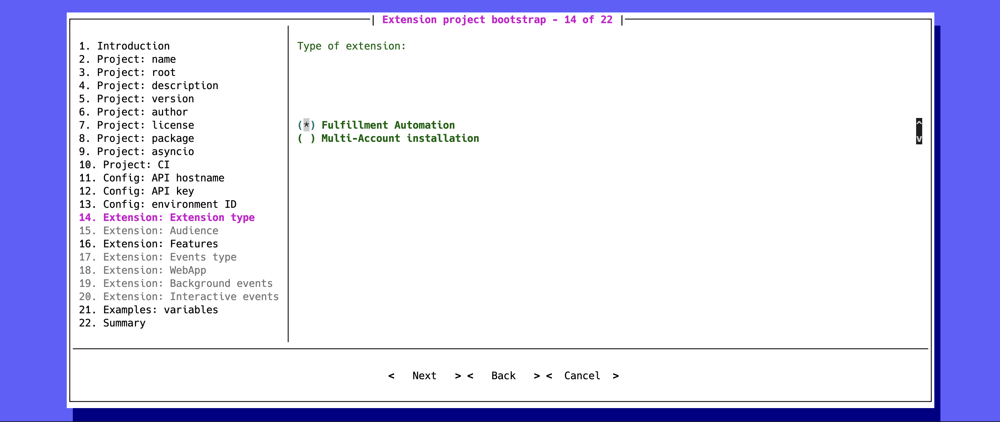

## Extension features

Choose `Events Processing` to generate a `Events Application` class:

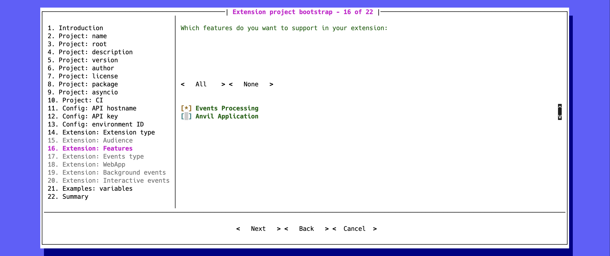


## Event categories

Select the categories of events you want to handle:

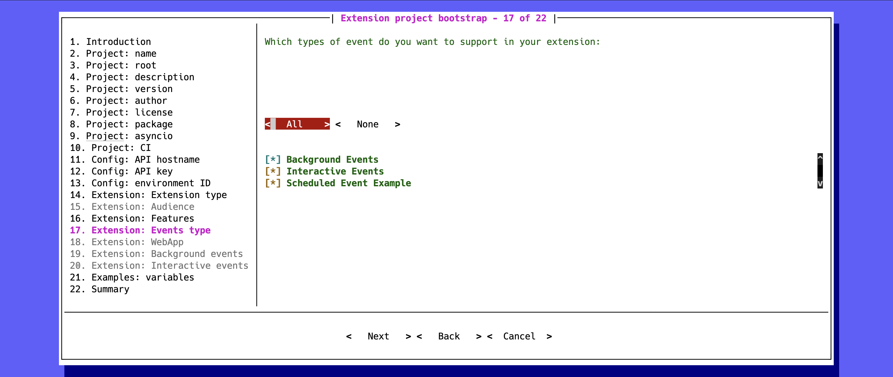


## Background events

Choose the background events you are interested in:

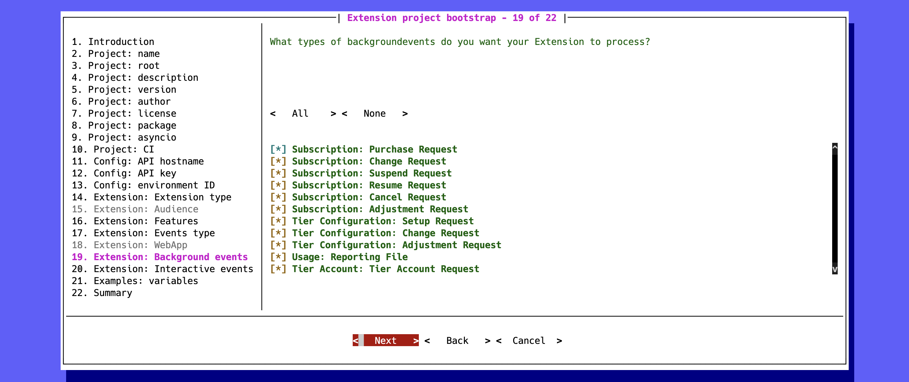


## Interactive events

Choose the interactive events you are interested in:


## Environment variables

If your extension will need some configuration in order to run choose `yes` to
generate an example of environment variables:


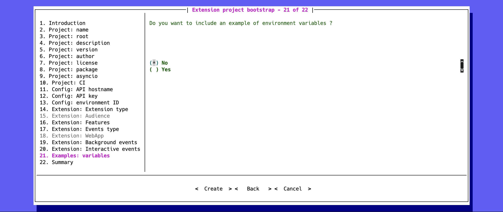


## Summary

The wizard will show a summary with the answers you provided:

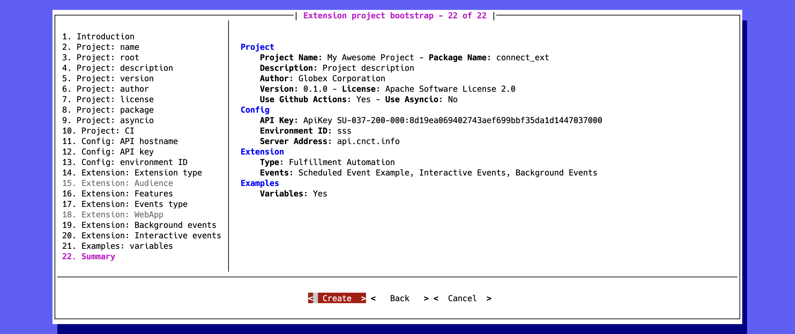

Select `Create` then press ++enter++, the extension project will be generated.


## Run your extension locally

To run your extension locally first of all you have to build the docker image for your extension.

Go to the project folder the CLI just generated and run:

```
$ docker compose build
```

Then to run your extension execute:

```
$ docker compose up <your_extension_slug>_dev
```

!!! success "Congratulations"
    Go to the Connect UI `DevOps` module details page of your extension,
    click the :material-refresh: button you will see your extension up and running!

