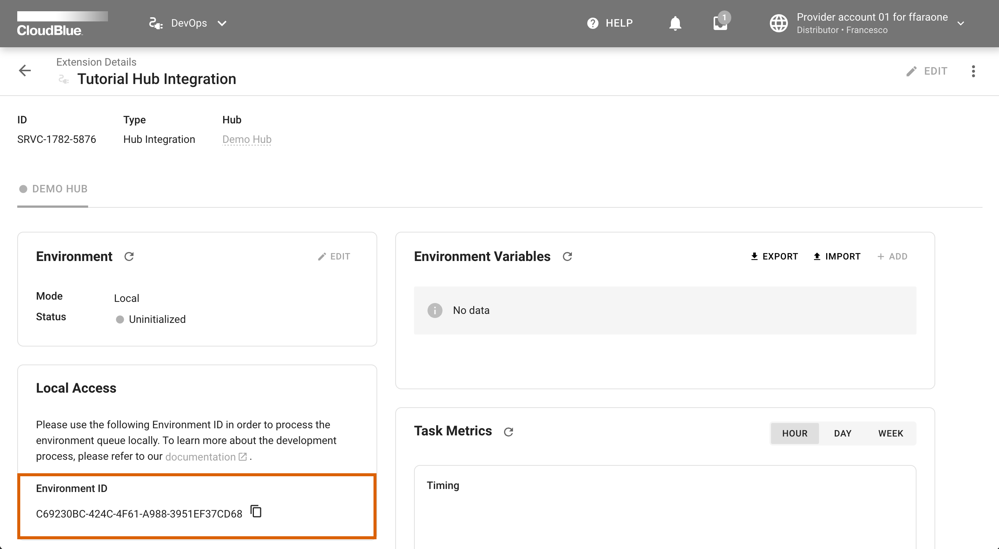

The following quickstart tutorial showcases how to create a `Hub Integration` extension project by using
the CloudBlue Connect [CLI tool](https://github.com/cloudblue/connect-cli).


## Requirements

Make sure that the following prerequisites are met:

* Python (3.8, 3.9 or 3.10) is installed
* [Docker](https://www.docker.com/) is installed
* The latest release of [Poetry](https://python-poetry.org/) is installed
* Latest release of [Connect CLI](https://github.com/cloudblue/connect-cli) is installed
* A **distributor** or **reseller** account on CloudBlue Connect is required


## Prepare distributor/reseller account

It is required to generate an API token and add your `distributor` or `reseller` account via the CLI tool.

Create a new token by using the Connect interface:

1. Navigate to `Integrations` -> `Tokens`.
2. Click the `+ Create Token` button.
3. Proivde a `name`, `description` and an optional `external id` for your token.
4. Next, choose `Custom Integration` from the extension list.
5. Select required permissions for your token, at least the `DevOps` option should be selected.
6. On the summary screen, click `Go To Details` to access your token details.
7. Click the :material-content-copy: button to copy your token.

Next, open your terminal and run:

```
$ ccli account add "<your copied token>"
```

Note that `<your copied token>` must be replaced with your generated API token.


## Create an extension in DevOps

Use the **DevOps** module on the Connect platform to create a `Hub Integration` extension:

1) Click on the `+ Add Extension` button to start configuring a new extension object.


2) Provide your extension name, select your hub and then click `Create`.


3) Click the `Open` button to access the details page of your created extension.


4) Locate the `Local Access` widget and click on the :material-content-copy: button to copy your `environment ID`.




## Run the `Extension Project Bootstrap` wizard

The CLI tool provides a wizard to bootstrap your extension project.

Use the following command to launch this wizard:


```
$ ccli project extension bootstrap
```

The wizard provides the welcome screen and the following options to configure your extension:


## Name your extension


Your provided extension name will be used for packaging metadata.


## Project root folder name


The root folder with all required files will be created once all operations with the wizard are completed.


## Describe your extension


Your provided description will be used to generate a readme file and for packaging metadata.


## Set initial version number


Your provided version is used for packaging metadata.


## Provide the author name


Your provided author name will be used for packaging metadata and to add a copyright header in each generated file.


## Choose python package name


Select a package name for your extension. It must be a valid python identifier (e.g., connect_ext). 


## Synchronous or asynchronous programming

In case you are familiar with python asyncio programming, select `yes` in the following step:


## Github actions

If you plan to host your git repository on github.com and you want to automate the
continuous integration of your project, select `yes` in the following step and an actions workflow file
will be created for you:


## Api Hostname

The wizard will propose to use a hostname of the Connect production environment by default:


## Api Key

The wizard will propose to use the same *Api Key* that is configured for your distributor/reseller account:


## Environment ID

Use your copied `environment ID` value from the `Local Access` widget of the details screen:


## Extension type

Select `Hub Integration` for this scenario:


## Extension features

Select `Events Processing` to generate an `Events Application` class:


## Event categories

Select categories of events you want to handle:


## Background events

Specify your required background events:


## Environment variables

In case your extension should use environment variables, choose `yes` to
generate example environment variables:


## Summary

As a result, the wizard will provide a summary with your selected options:


Select `Create` and press ++enter++ to generate your extension project.


## Run your extension locally

In order to run your extension locally, it is required to build a docker image for your extension.

Go to your generated project folder and run:

```
$ docker compose build
```

Thereafter, use the following command to execute your extension:

```
$ docker compose up <your_extension_slug>_dev
```

!!! success "Congratulations"
    Go to your extension details page via the Connect UI `DevOps` module and
    click the :material-refresh: button to see your extension up and running!
