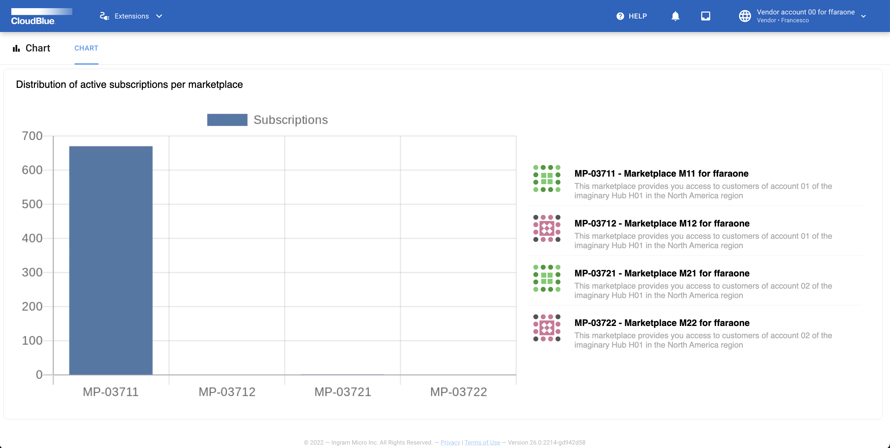
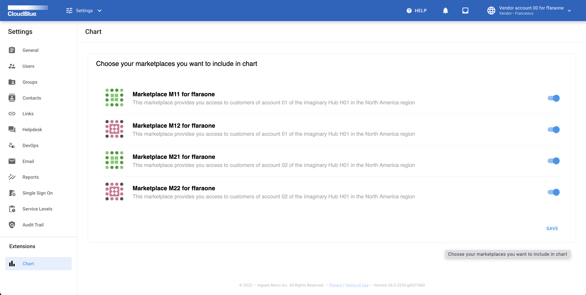

This tutorial provides step-by-step guidelines for creating a `Multi Account Installation` extension that implements a web application.
This application plugs into the Connect user interface by adding a module that renders a bar chart. This chart represents the distribution of active subscriptions for each included marketplace.

The provided app also adds a new tab to the `Settings` module. This tab allows account users to select marketplaces for the subsequent visualization of all available active subscriptions.

The first part of the tutorial demonstrates how to create a REST API that will be working with your user interface.
The second part showcases how to create a graphical user interface for your web application.

The backend of the demo web application is based on the Python web framework [FastAPI](https://fastapi.tiangolo.com/). Note that you will be able to easly complete the tutorial even if you are not familiar with such web framework.

!!! warning
    This tutorial assumes that you are using a *nix operating system. In case of using Windows, it is required to convert all provided commands to Windows Shell commands.
