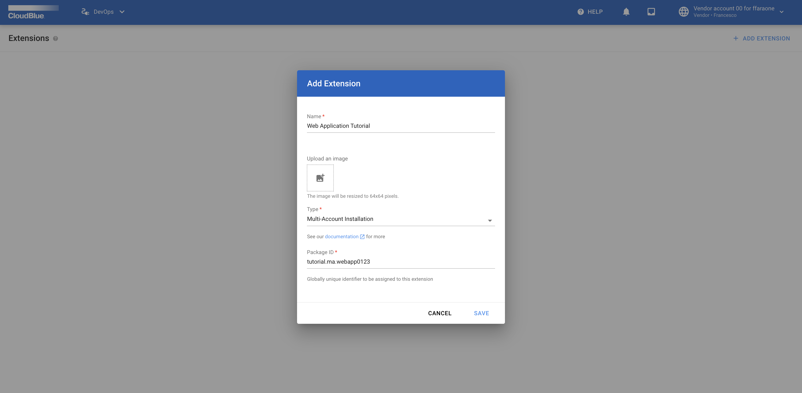
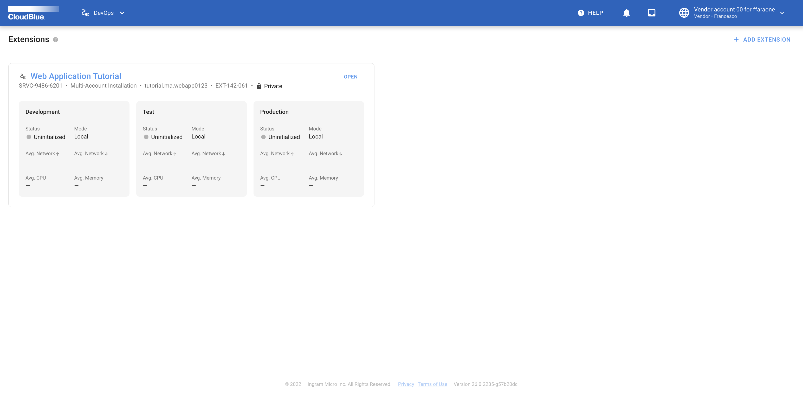
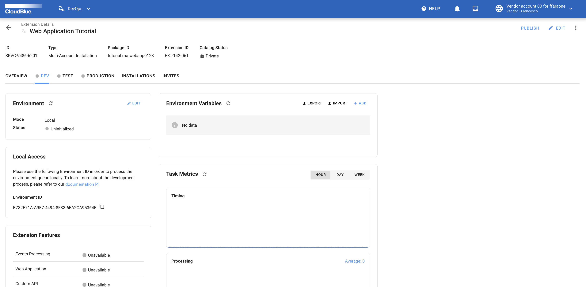

Once your REST API is configured, make sure to test your provided functionality. The following guidelines showcase how to test the demo web application for working with charts.

## Define your extension on Connect

To start working with your extension, it is required to add a `Multi Account Installation` extension by using the Connect UI.

Navigate to the `DevOps` module and click the **Add Extension** button.  
Select the `Multi Account Installation` type and specify your package ID:



Once your extension object is created, access the extension details screen by clicking on its name:



Switch to the `DEV` environment tab that will be used for the following tests:



Locate the `Local Access` widget and click on the :material-content-copy: button to copy your **environment ID**.

!!! info
    Once your a `Multi Account Installation` extension is created, an installation object owned by your account
    should be automatically created pointing to the `DEV` environment.


## Update your environment file 

Edit your `.chart_dev.env` file and provide the `ENVIRONMENT_ID` variable with your copied value.
Make sure that your `API_KEY` is assigned to your created API token on the Vendor account that includes your configured product.

!!! note
    Note that your created API key should also include all required module permissions.
    For more information on how to create an API Key, refer to the
    [Community Portal](https://connect.cloudblue.com/community/modules/extensions/api-tokens/).

## Build a Docker Image

Use the following bash command to build a docker image for your extension:


``` bash
$ docker compose build
```

## Run your extension

Once the image is composed, run your container by executing the following command:

``` bash
$ docker compose up chart_dev
```

Next, go to the Connect UI and check whether your extension is connected to the `DEV` environment by
using the :material-refresh: button located in the `Environment` widget.


## Test your `list marketplaces` endpoint

Copy your extension's base url from the `Custom API Methods` widget.

Thereafter, execute the following `curl` command:

``` bash
$ curl \
    -L \
    -X GET '<replace_with_extension_base_url>/api/marketplaces' \
    -H 'Authorization: <replace with your API key>'
```

As a result, you should receive JSON data similar to the following snippet:

``` json
[
    {
        "id": "MP-03711",
        "name": "Marketplace M11 for ffaraone",
        "description": "This marketplace provides you access to customers of account 01 of the imaginary Hub H01 in the North America region",
        "icon": "/media/PA-037-101/marketplaces/MP-03711/icon.png"
    },
    {
        "id": "MP-03712",
        "name": "Marketplace M12 for ffaraone",
        "description": "This marketplace provides you access to customers of account 01 of the imaginary Hub H01 in the North America region",
        "icon": "/media/PA-037-101/marketplaces/MP-03712/icon.png"
    },
    {
        "id": "MP-03721",
        "name": "Marketplace M21 for ffaraone",
        "description": "This marketplace provides you access to customers of account 02 of the imaginary Hub H01 in the North America region",
        "icon": "/media/PA-037-102/marketplaces/MP-03721/icon.png"
    },
    {
        "id": "MP-03722",
        "name": "Marketplace M22 for ffaraone",
        "description": "This marketplace provides you access to customers of account 02 of the imaginary Hub H01 in the North America region",
        "icon": "/media/PA-037-102/marketplaces/MP-03722/icon.png"
    }
]
```

## Test your `save settings` endpoint

Execute the following bash command from your terminal:

``` bash
$ curl \
    -L \
    -X POST '<replace_with_extension_base_url>/api/settings' \
    -H 'Authorization: <replace with your API key>' \
    -H 'Content-Type: application/json' \
    --data-raw '{
        "marketplaces": [
            {
                "id": "MP-03711",
                "name": "Marketplace M11 for ffaraone",
                "description": "This marketplace provides you access to customers of account 01 of the imaginary Hub H01 in the North America region",
                "icon": "/media/PA-037-101/marketplaces/MP-03711/icon.png"
            }
        ]
    }'
```

Consequently, you should receive the following response:

``` json
{
    "marketplaces": [
        {
            "id": "MP-03711",
            "name": "Marketplace M11 for ffaraone",
            "description": "This marketplace provides you access to customers of account 01 of the imaginary Hub H01 in the North America region",
            "icon": "/media/PA-037-101/marketplaces/MP-03711/icon.png"
        }
    ]
}
```

!!! success "Congratulations"
    :partying_face: Your configured REST API and `Web Application` work like a charm! :beers:
