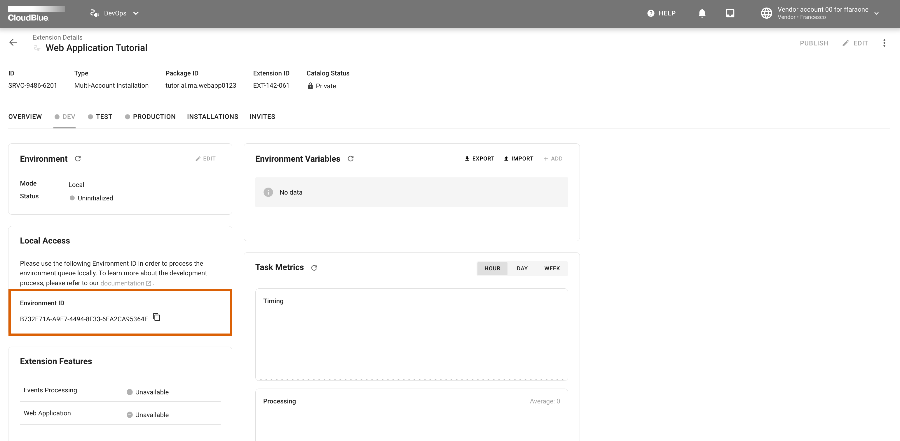

Now that your REST API is ready it's time to test it.

## Create an extension using the CloudBlue Connect User Interface

To do that you first need to go to the Connect UI to create an Extension of type `Multi Account Installation`.
From the main menu, navigate to the `DevOps` module and click the `Add extension` button
Fill the Add extension form like in the following picture:


Once created, open the details view of your brand new extension:


And select the `DEV` environment tab:



Go to the `Local Access` widget and click on the :material-content-copy: button to copy your environment ID.


!!! info
    Once you create an extension of type `Multi Account Installation` an installation owned by your account
    is automatically created for you pointing to the extension `DEV` environment.


## Update your `.chart_dev.env` environment file 

Edit your `.chart_dev.env` file and fill the `ENVIRONMENT_ID` variable with the copied value.


!!! warning
    This tutorial assume that you know how to create a Connect API key and that the
    `API_KEY` variable of the `.chart_dev.env` file is set with a valid value.
    For more information about how to create an API Key visit the
    [Connect Community Portal](https://connect.cloudblue.com/community/modules/extensions/api-tokens/).


## Build a Docker image for your extension

To build the Docker image for your extension run:


``` bash
$ docker compose build
```

## Run your extension

Once the image is build, to run your container execute:

``` bash
$ docker compose up chart_dev
```

Now go to the Connect UI and check that your extension is connected to the `DEV` environment
using the :material-refresh: button located in the `Environment` widget.


## Test your `list marketplaces` endpoint

First you need to copy your extension's base url from the `Custom API Methods` widget.

Then using `curl` execute:

``` bash
$ curl \
    -L \
    -X GET '<replace_with_extension_base_url>/api/marketplaces' \
    -H 'Authorization: <replace with your API key>'
```

And you should receive a JSON similar to the following:

``` json
[
    {
        "id": "MP-03711",
        "name": "Marketplace M11 for ffaraone",
        "description": "This marketplace provides you access to customers of account 01 of the imaginary Hub H01 in the North America region",
        "icon": "/media/PA-037-101/marketplaces/MP-03711/icon.png"
    },
    {
        "id": "MP-03712",
        "name": "Marketplace M12 for ffaraone",
        "description": "This marketplace provides you access to customers of account 01 of the imaginary Hub H01 in the North America region",
        "icon": "/media/PA-037-101/marketplaces/MP-03712/icon.png"
    },
    {
        "id": "MP-03721",
        "name": "Marketplace M21 for ffaraone",
        "description": "This marketplace provides you access to customers of account 02 of the imaginary Hub H01 in the North America region",
        "icon": "/media/PA-037-102/marketplaces/MP-03721/icon.png"
    },
    {
        "id": "MP-03722",
        "name": "Marketplace M22 for ffaraone",
        "description": "This marketplace provides you access to customers of account 02 of the imaginary Hub H01 in the North America region",
        "icon": "/media/PA-037-102/marketplaces/MP-03722/icon.png"
    }
]
```

## Test your `save settings` endpoint

From your terminal execute:

``` bash
$ curl \
    -L \
    -X POST '<replace_with_extension_base_url>/api/settings' \
    -H 'Authorization: <replace with your API key>' \
    -H 'Content-Type: application/json' \
    --data-raw '{
        "marketplaces": [
            {
                "id": "MP-03711",
                "name": "Marketplace M11 for ffaraone",
                "description": "This marketplace provides you access to customers of account 01 of the imaginary Hub H01 in the North America region",
                "icon": "/media/PA-037-101/marketplaces/MP-03711/icon.png"
            }
        ]
    }'
```

You should receive the following response:

``` json
{
    "marketplaces": [
        {
            "id": "MP-03711",
            "name": "Marketplace M11 for ffaraone",
            "description": "This marketplace provides you access to customers of account 01 of the imaginary Hub H01 in the North America region",
            "icon": "/media/PA-037-101/marketplaces/MP-03711/icon.png"
        }
    ]
}
```

!!! success "Congratulations"
    :partying_face: your first REST API of a `Web Application` works like a charm :beers:
