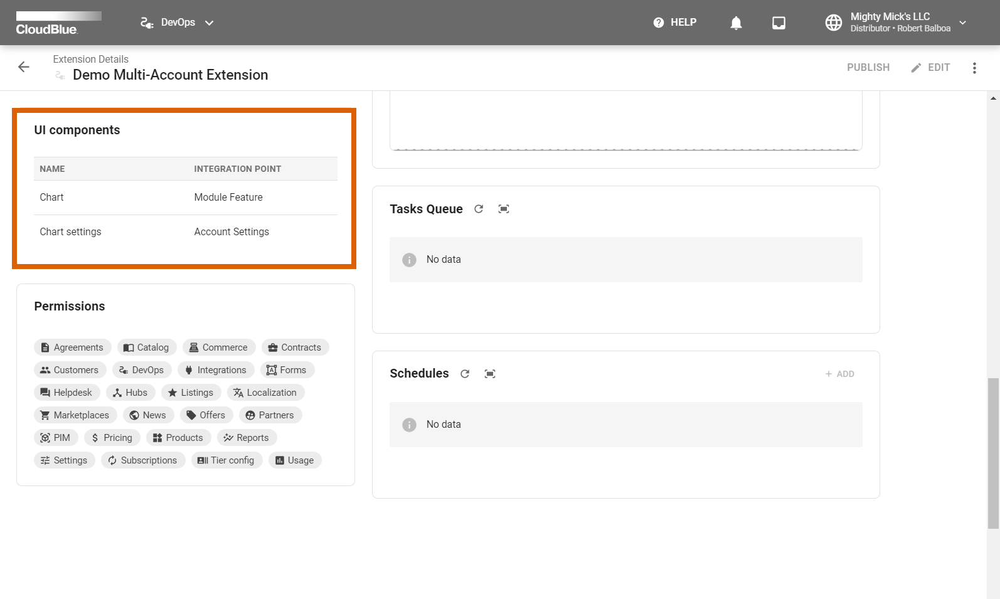
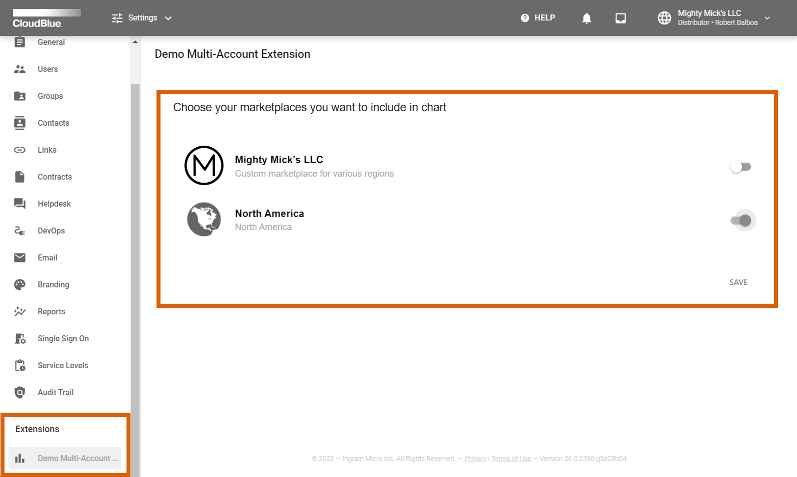
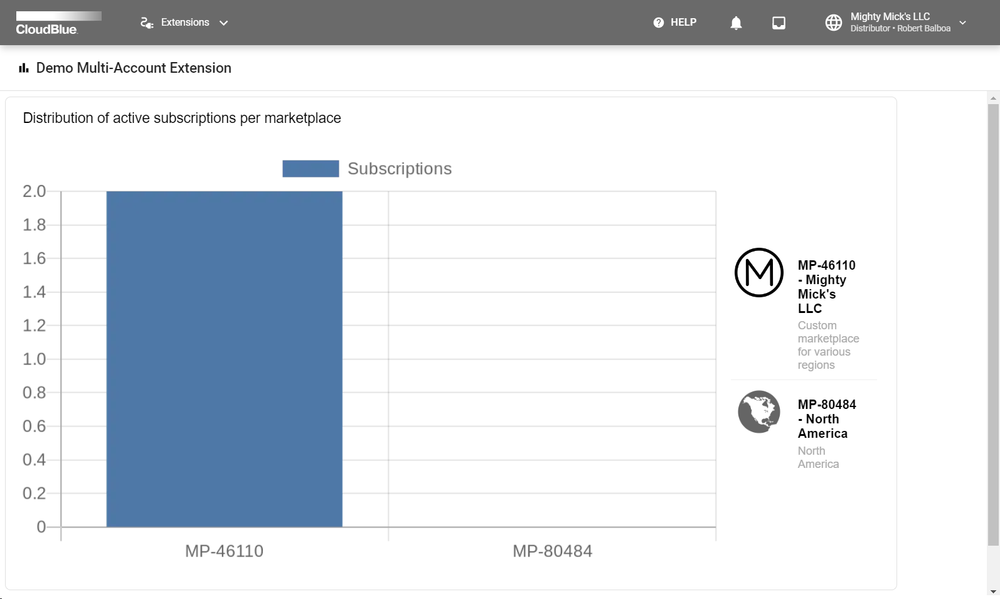

When your web application is configured and deployed, the CloudBlue Connect platform allows using the functionality of your application within the provided graphical user interface.

The following describes available user interface components and operations of the demo multi-account extension that is used to visualize available active subscriptions for your selected marketplaces.

## Previewing UI components

Once your extension is deployed, the Connect platform allows previewing available user interface components by using insights via the DevOps module. Access the details screen of your deployed extension by using this module and locate the UI components widget:

Your configured demo multi-account extension should provide the following components and integration points: `Module Feature` and `Account Settings`. Therefore, the system provides additional marketplace configurations within the *Settings* module on Connect and a *standalone* module that is used to access the chart functionality.

## Settings Interface 

In case your deployed demo multi-account extension displays the *connected* or *running* state in any of your configured environments, the Connect interface will render additional options within the **Settings** module. Navigate to this module and locate your new extension settings:

The demo extension should provide a list of your marketplaces that are registered on the Connect platform including their icons and descriptions. Consequently, enable or disable marketplaces to visualize their associated subscriptions by using corresponding switches on the user interface. Make sure to save your settings by using the provided **Save** button.

## Extension Module Interface

The Connect interface provides standalone module for your extension in case the corresponding UI component is defined in your extension. Your configured demo multi-account extension features a standalone module to access a chart with your active subscriptions for each of your selected marketplaces. 

Use the navigation menu to locate a module with your specified extension name. Connect will provide the following diagram in case your extension displays the *connected* or *running* state in any of your configured environments: 

## Additional Operations

Note that the CloudBlue Connect platform allows generating invites for your business partners to install your extension, manage each installation of your deployed extension, and publish your extension in the Showroom Catalog, and perform other operations in the `DevOps` module.

For more information on available operations for your multi-account extension, refer to the [Installation Management](https://connect.cloudblue.com/community/modules/devops/service-installations-management/) documentation on Community Portal.
